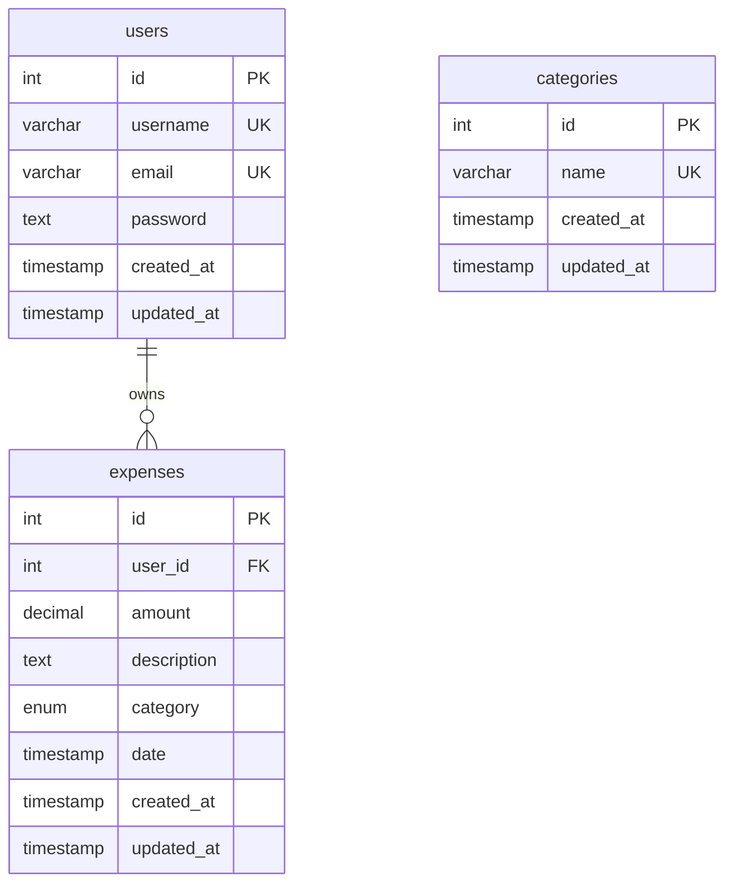

# Database Schema

MySQL database used by the Expense Tracker backend. Tables are defined in the model files and created automatically when the server starts.

**Production:** Aiven MySQL (SSL)  
**Local:** MySQL 8+ on `localhost`

Connection settings: see [development.md](./development.md#environment-variables) (`DB_HOST`, `DB_USER`, `DB_PASSWORD`, `DB_NAME`, `DB_PORT`, `DB_CA_CERT`).

---

## Entity-relationship diagram



### Relationship summary

| From | To | Cardinality | On delete |
|------|-----|-------------|-----------|
| `expenses.user_id` | `users.id` | Many expenses → one user | `CASCADE` |

> **Note:** The `categories` table exists in a migration file but is **not linked** to `expenses` and is **not used** by the API today. Categories on expenses are stored as an `ENUM` column on the `expenses` table.

---

## Tables in use

### `users`

Stores registered accounts. Passwords are hashed with bcrypt (10 rounds) before insert.

| Column | Type | Constraints | Description |
|--------|------|-------------|-------------|
| `id` | `INT` | PK, AUTO_INCREMENT | User ID (used in JWT as `userId`) |
| `username` | `VARCHAR(50)` | UNIQUE, NOT NULL | Display name / login identifier |
| `email` | `VARCHAR(100)` | UNIQUE, NOT NULL | Login email |
| `password` | `TEXT` | NOT NULL | bcrypt hash (never returned by API) |
| `created_at` | `TIMESTAMP` | DEFAULT `CURRENT_TIMESTAMP` | Account creation time |
| `updated_at` | `TIMESTAMP` | DEFAULT `CURRENT_TIMESTAMP ON UPDATE` | Last update time |

**Source:** `backend/models/User.js`

```sql
CREATE TABLE IF NOT EXISTS users (
  id INT NOT NULL AUTO_INCREMENT PRIMARY KEY,
  username VARCHAR(50) UNIQUE NOT NULL,
  email VARCHAR(100) UNIQUE NOT NULL,
  password TEXT NOT NULL,
  created_at TIMESTAMP DEFAULT CURRENT_TIMESTAMP,
  updated_at TIMESTAMP DEFAULT CURRENT_TIMESTAMP ON UPDATE CURRENT_TIMESTAMP
) ENGINE=InnoDB DEFAULT CHARSET=utf8mb4 COLLATE=utf8mb4_unicode_ci;
```

**Model methods (`User`):**

| Method | Description |
|--------|-------------|
| `User.create(userData, cb)` | Hash password, insert user, return `{ id, username, email, created_at }` |
| `User.findByEmail(email, cb)` | Find user by email (includes password hash) |
| `User.findByUsername(username, cb)` | Find user by username |
| `User.comparePassword(plain, hash, cb)` | bcrypt compare |

---

### `expenses`

Stores individual expense records. Every row belongs to exactly one user.

| Column | Type | Constraints | Description |
|--------|------|-------------|-------------|
| `id` | `INT` | PK, AUTO_INCREMENT | Expense ID |
| `user_id` | `INT` | NOT NULL, FK → `users.id` | Owner |
| `amount` | `DECIMAL(10,2)` | NOT NULL, `CHECK (amount >= 0)` | Expense amount |
| `description` | `TEXT` | NOT NULL | What the expense was for |
| `category` | `ENUM(...)` | NOT NULL | One of the fixed category values (see below) |
| `date` | `TIMESTAMP` | DEFAULT `CURRENT_TIMESTAMP` | When the expense occurred |
| `created_at` | `TIMESTAMP` | DEFAULT `CURRENT_TIMESTAMP` | Row creation time |
| `updated_at` | `TIMESTAMP` | DEFAULT `CURRENT_TIMESTAMP ON UPDATE` | Last update time |

**Allowed `category` values:**

`Food`, `Transport`, `Entertainment`, `Bills`, `Shopping`, `Others`

**Source:** `backend/models/Expense.js`

```sql
CREATE TABLE IF NOT EXISTS expenses (
  id INT NOT NULL AUTO_INCREMENT PRIMARY KEY,
  user_id INT NOT NULL,
  amount DECIMAL(10, 2) NOT NULL,
  description TEXT NOT NULL,
  category ENUM('Food', 'Transport', 'Entertainment', 'Bills', 'Shopping', 'Others') NOT NULL,
  date TIMESTAMP DEFAULT CURRENT_TIMESTAMP,
  created_at TIMESTAMP DEFAULT CURRENT_TIMESTAMP,
  updated_at TIMESTAMP DEFAULT CURRENT_TIMESTAMP ON UPDATE CURRENT_TIMESTAMP,
  FOREIGN KEY (user_id) REFERENCES users(id) ON DELETE CASCADE,
  CHECK (amount >= 0)
) ENGINE=InnoDB DEFAULT CHARSET=utf8mb4 COLLATE=utf8mb4_unicode_ci;
```

**Model methods (`Expense`):**

| Method | Description |
|--------|-------------|
| `new Expense(data).save(cb)` | Insert or update an expense |
| `Expense.findById(id, cb)` | Get one expense by ID |
| `Expense.findByUser(userId, cb)` | All expenses for a user (newest first) |
| `Expense.getByCategory(userId, cb)` | Sum amounts grouped by category |
| `Expense.getMonthlySummary(userId, year, month, cb)` | Totals grouped by year/month |
| `Expense.getRecent(userId, limit, cb)` | Latest N expenses |
| `Expense.getDailyExpenses(userId, year, month, cb)` | Per-day totals for a month |
| `Expense.delete(expenseId, userId, cb)` | Delete if owned by user |

**Data isolation:** All expense API routes filter by `user_id` from the JWT. Users cannot access another user's rows.

---

## Optional / unused table

### `categories`

Defined in `backend/migrations/001_create_categories_table.js`. **Not auto-created on server start** and **not referenced** by routes or models.

| Column | Type | Constraints |
|--------|------|-------------|
| `id` | `INT` | PK, AUTO_INCREMENT |
| `name` | `VARCHAR(50)` | UNIQUE, NOT NULL |
| `created_at` | `TIMESTAMP` | DEFAULT `CURRENT_TIMESTAMP` |
| `updated_at` | `TIMESTAMP` | DEFAULT `CURRENT_TIMESTAMP ON UPDATE` |

Default seed values: `Food`, `Transport`, `Entertainment`, `Bills`, `Shopping`, `Others`

To create it manually:

```bash
cd backend
node migrations/001_create_categories_table.js
```

The `GET /api/expenses/categories` endpoint does **not** read this table — it aggregates distinct `category` values from the `expenses` table.

---

## How the schema is created

| Mechanism | What it does |
|-----------|--------------|
| **Server startup** | `server.js` loads `User.js` and `Expense.js`, which run `CREATE TABLE IF NOT EXISTS` for `users` and `expenses` |
| **Migration script** | `migrations/001_create_categories_table.js` — optional, manual |
| **Reset script** | `scripts/reset-db.js` — drops and recreates `users` + `expenses` (destructive) |

There is no migration runner (e.g. Knex/Flyway) — schema changes are applied via model `CREATE TABLE` statements or manual scripts.

---

## Indexes and keys

| Table | Key | Columns |
|-------|-----|---------|
| `users` | PRIMARY | `id` |
| `users` | UNIQUE | `username` |
| `users` | UNIQUE | `email` |
| `expenses` | PRIMARY | `id` |
| `expenses` | FOREIGN KEY | `user_id` → `users(id)` ON DELETE CASCADE |

No additional indexes are defined in code. At scale, consider indexes on `expenses(user_id)`, `expenses(date)`, and `expenses(user_id, date)`.

---

## Schema vs README

The [README.md](../README.md) database section is **outdated**. Differences from the actual schema:

| README says | Actual schema |
|-------------|---------------|
| `password VARCHAR(255)` | `password TEXT` |
| `description VARCHAR(255)` | `description TEXT` |
| `category VARCHAR(50)` | `category ENUM(...)` |
| `date DATE` | `date TIMESTAMP` |
| No `updated_at` on users/expenses | Both tables have `updated_at` |

**This document (`docs/database.md`) is the canonical schema reference.**

---

## Related docs

- [api.md](./api.md) — REST endpoints that read/write these tables
- [development.md](./development.md) — local DB setup
- [deployment/architecture.md](./deployment/architecture.md) — production DB (Aiven)