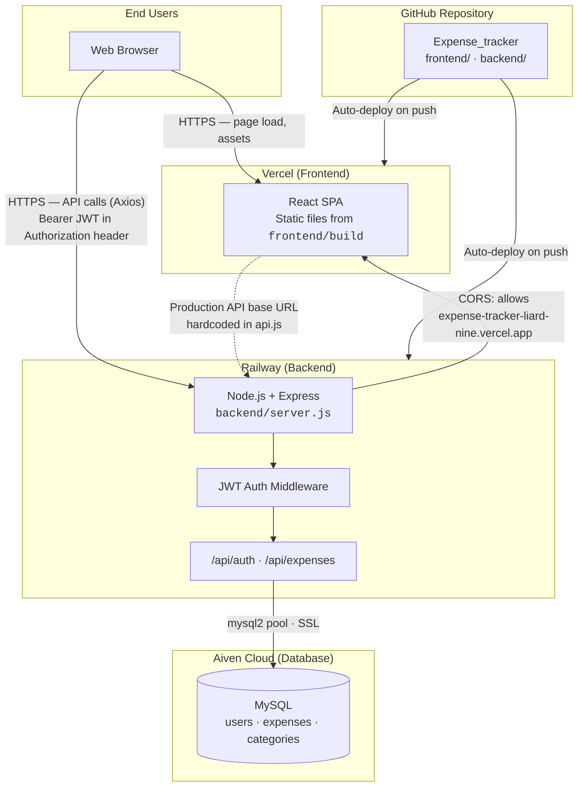
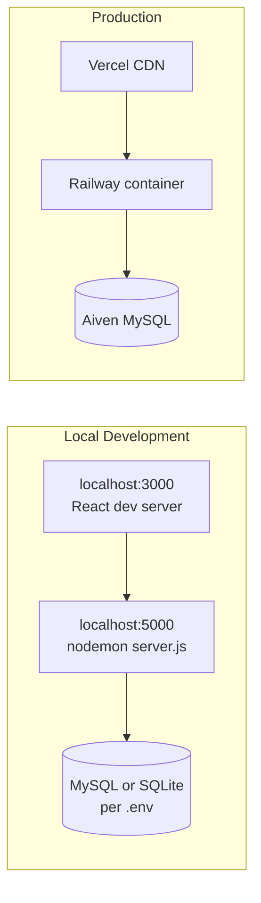
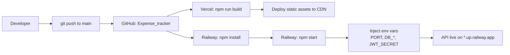

# Expense Tracker — Deployment Architecture

This document describes how the Expense Tracker application is deployed in production today.

## Overview

The app uses a **three-tier, multi-cloud** layout:

| Layer    | Platform      | Role                                      |
|----------|---------------|-------------------------------------------|
| Frontend | **Vercel**    | Hosts the React SPA (static build)        |
| Backend  | **Railway**   | Runs the Node.js / Express REST API       |
| Database | **Aiven**     | Managed MySQL (SSL)                       |

Source code lives in a single GitHub repository. Vercel and Railway are both connected to that repo and deploy from it (no Docker, Kubernetes, or CI workflow files in the repo).

## Production URLs

| Service  | URL |
|----------|-----|
| Frontend | https://expense-tracker-liard-nine.vercel.app |
| Backend  | https://expensetracker-production-b2a5.up.railway.app |
| Database | Aiven Cloud MySQL (private host; not exposed to the browser) |

## Architecture Diagram



## Request Flow (Authenticated API Call)

```mermaid
sequenceDiagram
    actor User
    participant Vercel as Vercel (React SPA)
    participant Railway as Railway (Express API)
    participant Aiven as Aiven (MySQL)

    User->>Vercel: Open app / navigate
    Vercel-->>User: Serve static HTML/JS/CSS

    User->>Vercel: Login (email + password)
    Vercel->>Railway: POST /api/auth/login
    Railway->>Aiven: Query users table
    Aiven-->>Railway: User record
    Railway-->>Vercel: JWT token
    Vercel->>Vercel: Store token in localStorage

    User->>Vercel: View dashboard / add expense
    Vercel->>Railway: GET/POST /api/expenses/*<br/>Authorization: Bearer &lt;token&gt;
    Railway->>Railway: Verify JWT (auth middleware)
    Railway->>Aiven: Read/write expenses
    Aiven-->>Railway: Data
    Railway-->>Vercel: JSON response
    Vercel-->>User: Render UI
```

## Component Details

### Frontend (Vercel)

- **Source:** `frontend/`
- **Framework:** React 18 (Create React App via `react-scripts`)
- **Build command:** `npm run build`
- **Output directory:** `build/`
- **Routing:** Client-side (`react-router-dom`) — `/login`, `/register`, `/dashboard`, `/add-expense`, `/monthly-expenses`
- **API client:** `frontend/src/services/api.js` (Axios)
- **Production API URL:** `https://expensetracker-production-b2a5.up.railway.app/api` (set when `NODE_ENV !== 'development'`)
- **Auth:** JWT stored in `localStorage`; attached to requests via Axios interceptor

There is no `vercel.json` in the repository — Vercel project settings (root directory, build command, output folder) are configured in the Vercel dashboard.

### Backend (Railway)

- **Source:** `backend/`
- **Runtime:** Node.js (engine `>=14.0.0`)
- **Entry point:** `server.js`
- **Start command:** `npm start` → `node server.js`
- **Port:** `process.env.PORT` (Railway injects this)
- **Routes:**
  - `POST /api/auth/register`, `POST /api/auth/login`
  - `GET|POST|PUT|DELETE /api/expenses/*` (protected)
- **CORS:** In production, only `https://expense-tracker-liard-nine.vercel.app` is allowed (plus localhost in development)
- **Database access:** `backend/config/db.js` — `mysql2` connection pool with SSL

There is no `railway.toml` or `Procfile` in the repository — Railway service settings and environment variables are configured in the Railway dashboard.

### Database (Aiven Cloud)

- **Engine:** MySQL 8
- **Connection:** SSL enabled (`rejectUnauthorized: false`; optional `DB_CA_CERT`)
- **Tables:** `users`, `expenses`, `categories` (created/managed by backend models and migrations)
- **Access:** Only the Railway backend connects; the database is not reachable from the browser or Vercel

## Environment Variables

### Railway (Backend)

| Variable       | Purpose                          |
|----------------|----------------------------------|
| `PORT`         | HTTP port (set by Railway)       |
| `NODE_ENV`     | `production` in deployed env     |
| `JWT_SECRET`   | Signs and verifies JWT tokens    |
| `JWT_EXPIRE`   | Token lifetime (e.g. `24h`)      |
| `DB_HOST`      | Aiven MySQL hostname             |
| `DB_USER`      | Database user                    |
| `DB_PASSWORD`  | Database password                |
| `DB_NAME`      | Database name                    |
| `DB_PORT`      | MySQL port (if non-default)      |
| `DB_CA_CERT`   | Optional CA certificate for SSL  |

### Vercel (Frontend)

The production frontend does **not** use `REACT_APP_*` variables for the API URL today — the Railway URL is hardcoded in `api.js`. Vercel mainly needs the standard CRA build settings (build command + output directory).

## Local Development vs Production



| Aspect        | Development                         | Production                              |
|---------------|-------------------------------------|-----------------------------------------|
| Frontend      | `npm start` on port 3000            | Vercel serves `frontend/build`          |
| Backend       | `npm run dev` (nodemon) on 5000     | Railway runs `npm start`                |
| API URL       | `http://localhost:5000/api`         | Railway production URL                  |
| CORS          | All origins allowed                 | Vercel origin only                      |
| Database      | Local `.env` credentials            | Aiven credentials on Railway            |

## Deployment Pipeline



There is no `.github/workflows` CI/CD in the repo — each platform builds and deploys independently when the connected branch is updated.

## Security Notes

- JWTs are issued by the backend and validated on protected routes via `backend/middleware/auth.js`.
- CORS restricts browser-origin API access in production to the Vercel domain.
- Database credentials exist only on Railway; they are never shipped to the frontend bundle.
- MySQL traffic from Railway to Aiven uses SSL.

## Key Source Files

| File | Role |
|------|------|
| `frontend/src/services/api.js` | API base URL and Axios/JWT setup |
| `frontend/package.json` | `build` script for Vercel |
| `backend/server.js` | Express app, CORS, route mounting |
| `backend/config/db.js` | Aiven MySQL pool configuration |
| `backend/middleware/auth.js` | JWT verification |
| `README.md` | High-level deployment instructions |