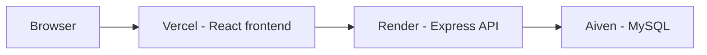
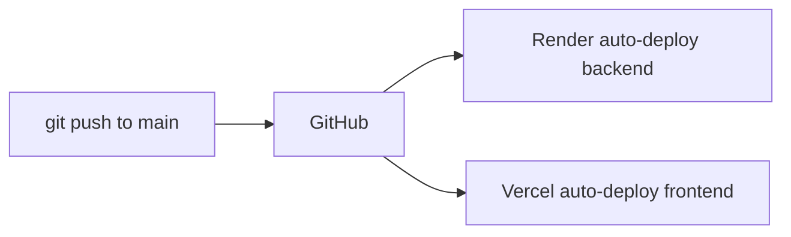

# Migrating Backend to Render

Guide for moving the Expense Tracker API from Railway to Render using **environment variables only** — no hardcoded URLs in source code.

Use the checklist below as your single source of truth. Edit this file and change `[ ]` to `[x]` as you complete each item so you can stop and resume at any point.

### Current status (last audited: 2026-07-15, git email verified)

| Phase | Status | Notes |
|-------|--------|-------|
| **Phase 0** — Code prep | **Mostly done** | All code pushed in `afde353`; local smoke test not confirmed |
| **Phase 1** — Render | **Not started** | No Render URL recorded |
| **Phase 2** — Vercel | **Not started** | Production likely still on old Railway API (or broken — Railway returns 404) |
| **Phase 3** — Verify | **Not started** | — |
| **Phase 4** — Cleanup | **Not started** | `architecture.md` / `README.md` still reference Railway |

**You are here →** Finish Phase 0 local test, then start **Phase 1 (Render)**.

---

## Migration Checklist

### Record your URLs (fill in as you go)

| Item | Your value |
|------|------------|
| Vercel frontend URL | `https://expense-tracker-liard-nine.vercel.app` ✅ live |
| Render backend URL | `https://________________.onrender.com` ⬜ not created yet |
| Railway backend URL (old) | `https://expensetracker-production-b2a5.up.railway.app` ⚠️ returns 404 |
| Aiven DB host | `________________.aivencloud.com` ⬜ fill from Aiven console |

---

### Phase 0 — Code preparation (repo)

Required code changes so URLs are not hardcoded:

- [x] `frontend/src/config.js` exists and reads `REACT_APP_API_URL`
- [x] `frontend/src/services/api.js` imports from `config.js` (no Railway URL)
- [x] `backend/server.js` reads `CORS_ALLOWED_ORIGINS` (no hardcoded Vercel URL)
- [x] `frontend/.env.example` documents `REACT_APP_API_URL`
- [x] `backend/.env.example` documents `CORS_ALLOWED_ORIGINS` and `DB_*` vars
- [x] Changes committed and pushed to `main` (`afde353`)

**Verify locally before deploying:**

```bash
cd backend && cp .env.example .env   # fill in values
npm run dev

cd frontend && cp .env.example .env  # REACT_APP_API_URL=http://localhost:5000/api
npm start
```

- [ ] Local login and add-expense flow works
- [ ] `frontend/.env` created locally (missing on this machine as of last audit)
- [ ] `backend/.env` uses a **local** DB for safe dev (current local file points at Aiven — see note below)

> **Safety note:** If `backend/.env` has Aiven `DB_HOST`, local dev writes to **production data**. Use `DB_HOST=localhost` for safe testing.

---

### Phase 1 — Render backend setup

- [ ] Render account ready (Hobby / free workspace)
- [ ] **New → Web Service** created and linked to GitHub repo
- [ ] Service settings configured:

| Setting | Value | Done |
|---------|-------|------|
| Root Directory | `backend` | [ ] |
| Branch | `main` | [ ] |
| Build Command | `npm install` | [ ] |
| Start Command | `npm start` | [ ] |
| Instance Type | Free | [ ] |

- [ ] Environment variables set on Render:

| Variable | Set? |
|----------|------|
| `NODE_ENV=production` | [ ] |
| `JWT_SECRET` | [ ] |
| `DB_HOST` | [ ] |
| `DB_USER` | [ ] |
| `DB_PASSWORD` | [ ] |
| `DB_NAME` | [ ] |
| `DB_PORT` | [ ] |
| `CORS_ALLOWED_ORIGINS` (Vercel URL, no trailing slash) | [ ] |
| `DB_CA_CERT` (if Aiven requires it) | [ ] |

- [ ] First deploy succeeded (green status in Render dashboard)
- [ ] Render service URL recorded in the table above
- [ ] Health check passes:

```bash
curl https://<your-render-service>.onrender.com/
# Expected: Expense Tracker API is running
```

- [ ] Render logs show: `Successfully connected to MySQL database`

---

### Phase 2 — Vercel frontend update

- [ ] `REACT_APP_API_URL` set in Vercel → Settings → Environment Variables
  - Value: `https://<your-render-service>.onrender.com/api`
- [ ] Applied to **Production** environment (and Preview if used)
- [ ] Frontend redeployed (new deployment after env var change)
- [ ] New deployment build completed successfully

---

### Phase 3 — End-to-end verification

- [ ] Open Vercel app in browser (hard refresh or incognito)
- [ ] Register or log in works
- [ ] Dashboard loads expense data
- [ ] Add expense works
- [ ] No CORS errors in browser DevTools console
- [ ] CORS preflight check passes:

```bash
curl -X OPTIONS https://<your-render-service>.onrender.com/api/auth/login \
  -H "Origin: https://expense-tracker-liard-nine.vercel.app" \
  -H "Access-Control-Request-Method: POST" -i
```

- [ ] Acceptable cold-start delay after idle (~1 min on Render free tier)

---

### Phase 4 — Cleanup and docs

- [ ] Railway backend paused or deleted
- [ ] `docs/deployment/architecture.md` updated with Render URL (replace Railway references)
- [ ] README.md deployment section updated (optional)
- [ ] All checklist items above marked `[x]`

---

### Resuming mid-migration

If you stop partway through, use this to find your place:

| If this is true… | You are here | Next step |
|------------------|--------------|-----------|
| Code changes not pushed | Phase 0 | Finish code, commit, push |
| Render service exists but Vercel still points to Railway | Phase 2 | Set `REACT_APP_API_URL`, redeploy Vercel |
| Vercel updated but login fails with CORS error | Phase 3 | Fix `CORS_ALLOWED_ORIGINS` on Render (exact Vercel URL) |
| Vercel updated but API returns 502 / timeout | Phase 1 or 3 | Check Render logs; service may be spinning up (free tier) |
| Everything works on Render | Phase 4 | Decommission Railway, update docs |
| Unsure which API the frontend uses | — | Open browser DevTools → Network → check request host on `/api/*` calls |

---

### What does **not** need changing

- [x] N/A — `backend/package.json` (`npm start` works on Render as-is)
- [x] N/A — `backend/config/db.js` (already uses `DB_*` env vars)
- [x] N/A — Aiven database (same instance, new connection from Render)
- [x] N/A — Docker / Procfile / `render.yaml` (optional, not required)
- [x] N/A — GitHub Actions workflow (Render native Git deploy is enough)

---

## Target Architecture



| Component | Platform | Configured via |
|-----------|----------|----------------|
| Frontend | Vercel | `REACT_APP_API_URL` |
| Backend | Render | `CORS_ALLOWED_ORIGINS`, `DB_*`, `JWT_SECRET` |
| Database | Aiven | Unchanged — same MySQL instance |

## Code Changes (already in repo)

Hardcoded URLs were removed in favour of env vars:

| File | Variable | Purpose |
|------|----------|---------|
| `frontend/src/config.js` | `REACT_APP_API_URL` | API base URL for Axios |
| `backend/server.js` | `CORS_ALLOWED_ORIGINS` | Comma-separated allowed frontend origins |

Local defaults still work without extra setup (`localhost:5000/api` and localhost CORS origins).

---

## Step 1 — Create the Render Web Service

1. Open [Render Dashboard](https://dashboard.render.com) → **New** → **Web Service**.
2. Connect the `Expense_tracker` GitHub repo.
3. Configure the service:

| Setting | Value |
|---------|-------|
| Name | `expense-tracker-api` (or your choice) |
| Region | Closest to your Aiven DB region |
| Branch | `main` |
| Root Directory | `backend` |
| Runtime | Node |
| Build Command | `npm install` |
| Start Command | `npm start` |
| Instance Type | **Free** |

4. Add environment variables (see table below).
5. Deploy and copy the service URL (e.g. `https://expense-tracker-api.onrender.com`).

### Render environment variables

| Key | Example | Notes |
|-----|---------|-------|
| `NODE_ENV` | `production` | Enables strict CORS |
| `JWT_SECRET` | `your-strong-secret` | Same value as Railway (keeps existing tokens valid until they expire) |
| `JWT_EXPIRE` | `24h` | Optional |
| `DB_HOST` | `*.aivencloud.com` | From Aiven console |
| `DB_USER` | `avnadmin` | From Aiven |
| `DB_PASSWORD` | `***` | From Aiven |
| `DB_NAME` | `expense_tracker` | Your DB name |
| `DB_PORT` | `3306` | Aiven port (often non-default) |
| `DB_CA_CERT` | `-----BEGIN CERTIFICATE-----...` | If required by Aiven SSL |
| `CORS_ALLOWED_ORIGINS` | `https://expense-tracker-liard-nine.vercel.app` | Your Vercel URL; comma-separate multiple origins |

`PORT` is injected automatically by Render — do not set it manually.

---

## Step 2 — Update Vercel Frontend

In the Vercel project → **Settings** → **Environment Variables**:

| Key | Value |
|-----|-------|
| `REACT_APP_API_URL` | `https://<your-render-service>.onrender.com/api` |

Apply to **Production** (and Preview if you use preview deployments).

Redeploy the frontend so CRA bakes the new URL into the build.

---

## Step 3 — Verify

1. Open the Vercel app → log in → add an expense.
2. Check Render logs for successful DB connection (`Successfully connected to MySQL`).
3. If CORS errors appear in the browser console, confirm `CORS_ALLOWED_ORIGINS` matches the Vercel URL exactly (scheme + host, no trailing slash).

### Quick API checks

```bash
curl https://<your-render-service>.onrender.com/
# Expected: Expense Tracker API is running

curl -X OPTIONS https://<your-render-service>.onrender.com/api/auth/login \
  -H "Origin: https://expense-tracker-liard-nine.vercel.app" \
  -H "Access-Control-Request-Method: POST" -i
# Expected: Access-Control-Allow-Origin header present
```

---

## Step 4 — Decommission Railway

After Render is stable for a few days:

1. Remove the old Railway service (or pause it).
2. Update `docs/deployment/architecture.md` with the new Render URL.

---

## Free Tier Expectations

- **Cold starts:** ~1 minute after 15 minutes idle.
- **750 free hours/month** shared across all free web services in your workspace.
- Two hobby backends with low traffic usually fit; two always-on 24/7 backends may hit the monthly cap.

---

## GitHub Actions — Useful or Not?

### Render + Vercel already support native Git deploys

Both platforms can watch your repo and deploy on push **without** a GitHub workflow. For this project, that is the simplest and recommended default.



### When a GitHub workflow **is** useful

| Use case | Benefit |
|----------|---------|
| Run tests/lint before deploy | Catch breakage before it reaches Render |
| Path filters | Deploy backend only when `backend/` changes |
| Staging + production | Different env vars per branch |
| Multi-platform orchestration | One pipeline for Render + Vercel + DB migrations |
| Required checks | Block merge until CI passes |

Example lightweight CI-only workflow (no deploy step):

```yaml
name: CI
on:
  push:
    branches: [main]
  pull_request:
    branches: [main]
jobs:
  backend:
    runs-on: ubuntu-latest
    defaults:
      run:
        working-directory: backend
    steps:
      - uses: actions/checkout@v4
      - uses: actions/setup-node@v4
        with:
          node-version: 20
      - run: npm ci
      - run: npm test --if-present
  frontend:
    runs-on: ubuntu-latest
    defaults:
      run:
        working-directory: frontend
    steps:
      - uses: actions/checkout@v4
      - uses: actions/setup-node@v4
        with:
          node-version: 20
      - run: npm ci
      - run: npm test --ci --watchAll=false --if-present
      - run: npm run build
        env:
          REACT_APP_API_URL: http://localhost:5000/api
```

### When a GitHub workflow is **not** needed

- Solo hobby project with low change frequency.
- You are fine with Render/Vercel deploying immediately on push.
- You do not run automated tests yet.

Using GitHub Actions **only to trigger Render deploy** duplicates what Render's GitHub integration already does and adds maintenance (secrets, workflow YAML, failure debugging).

### Recommendation for Expense Tracker

| Approach | Verdict |
|----------|---------|
| Render native Git deploy | **Use this** — connect repo, set root dir to `backend`, auto-deploy on push |
| Vercel native Git deploy | **Keep this** — set `REACT_APP_API_URL` in dashboard |
| GitHub Actions for deploy | **Skip** — redundant unless you need custom gates |
| GitHub Actions for CI only | **Optional** — add later when you have tests worth running |

---

## Local Development

See **[docs/development.md](../development.md)** for the full localhost guide (commands, env vars, verification, and troubleshooting).

No code changes are needed when switching between local, Render, or any future host — only env vars change.